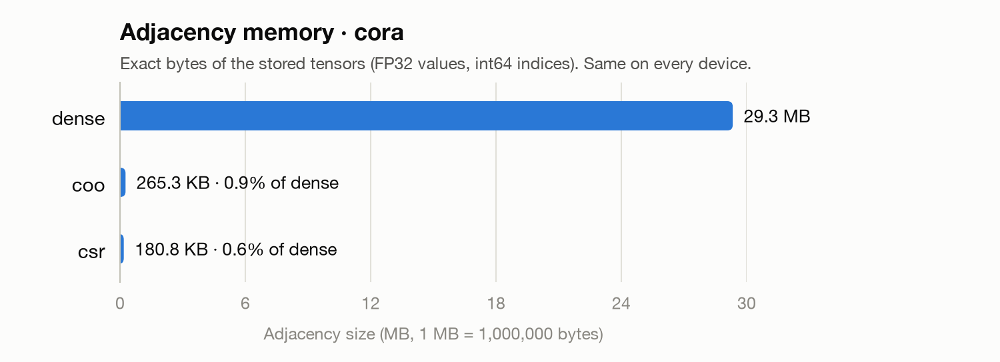
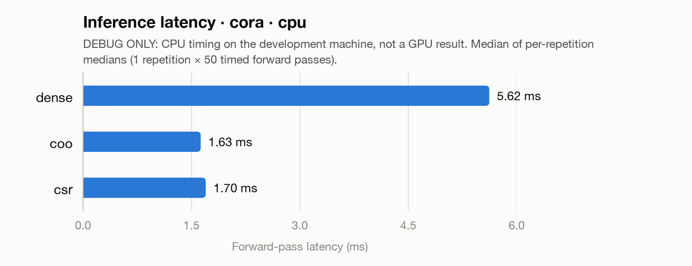

# GCN results summary

Generated by `scripts/summarize_gcn_results.py` from `results/raw`. Latency measured on CPU (or any non-CUDA device) is for debugging only and is not a GPU result.

## cora

### Training (checkpoint)

| Best epoch | Val acc | Test acc | Seed | Hidden | Dropout | Trained with |
|:---|---:|---:|---:|---:|---:|---:|
| 55 | 81.00% | 81.90% | 42 | 64 | 0.5 | COO |

### Prediction equivalence · cpu

| Format | Test acc | Acc diff (pp) | Agree (all) | Agree (test) | Mean \|Δlogit\| | Max \|Δlogit\| | allclose | Equivalent |
|:---|---:|---:|---:|---:|---:|---:|---:|---:|
| dense | 81.90% | +0.00 | 100.00% | 100.00% | 0.0e+00 | 0.0e+00 | yes | yes |
| coo | 81.90% | +0.00 | 100.00% | 100.00% | 0.0e+00 | 0.0e+00 | yes | yes |
| csr | 81.90% | +0.00 | 100.00% | 100.00% | 0.0e+00 | 0.0e+00 | yes | yes |

All formats equivalent: yes (reference: COO; allclose atol=1e-5, rtol=1e-4)

### Adjacency memory

| Format | Bytes | Size | % of dense | Components (bytes) |
|:---|---:|---:|---:|---:|
| dense | 29,333,056 | 29.3 MB | 100.00% | values 29,333,056 |
| coo | 265,280 | 265.3 KB | 0.90% | values 53,056 + indices 212,224 |
| csr | 180,840 | 180.8 KB | 0.62% | values 53,056 + col_indices 106,112 + crow_indices 21,672 |

### Inference latency · cpu (DEBUG ONLY, not a GPU result)

| Format | Reps | Median (ms) | Mean (ms) | Std (ms) | Min (ms) | Max (ms) | Peak CUDA alloc | Peak CUDA reserved | Matches COO |
|:---|---:|---:|---:|---:|---:|---:|---:|---:|---:|
| dense | 1 | 5.620 | 5.737 | 0.242 | 5.492 | 6.602 | n/a | n/a | yes |
| coo | 1 | 1.627 | 1.653 | 0.084 | 1.545 | 1.983 | n/a | n/a | yes |
| csr | 1 | 1.697 | 1.726 | 0.128 | 1.603 | 2.340 | n/a | n/a | yes |
